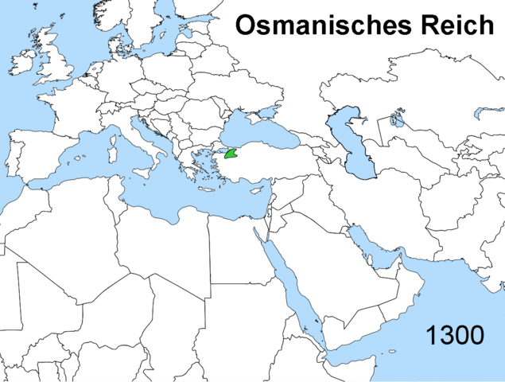

This site provides proposals and tools concerning Armenia, the Southern Caucasus and the greater region, serving policy and decision makers.

Policy suggestions are available in multiple languages, available upon request.

[Contact:](./../contact) **info@regionalkinetics.com**

Policies of nation states change with their interests. National borders are the most ephemeral. This annimation shows how the expansion and contraction of a typical state is the rule rather than the expection. In this example, the Ottoman Empire conquored and expanded jurisdiction over states and peoples, starting from the Battle of Manzikert in 1073 to Osman declaring himself Sultan in 1299. By 1566 the empire expanded through the Balkans nearly reaching Vienna, Crimea, parts of Ukraine, across North Arrica and the Arabian Gulf.

By the early 19th century, the Ottoman Empire began losing land to its indigenous populations, including the Caucasus, the northern shores of the Black Sea, Egypt, areas of North Africa, Greece and most all of its former Balkan territory.

After WWI, the empire lost all of its former Arab lands and shrinking into an area covering only a small portion of northern Anatolia.

By 1923 all that remained became the Republic of Turkey, with many former Ottoman subjects becoming independant nation states. (annimation courtisy of wikicommons)